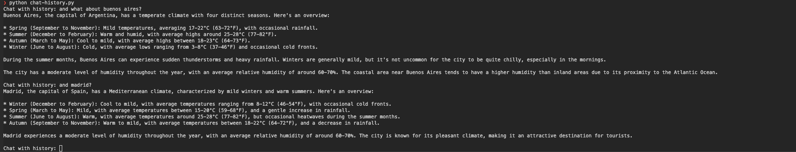

# Ollama 01 example

## Requirements

Install ollama 

https://ollama.com/

https://github.com/ollama/ollama?tab=readme-ov-file#ollama

```
ollama pull <model>:<version>
ollama run
ollama list
ollama rm
```

Ensure you have ollama in your machine and available. Pull llama 3.2:1b model:
```
ollama pull llama3.2:1b
```

Python version: 3.11.10

## Run the python script

```
python3 -m venv venv

source venv/bin/activate

pip install -r requirements.txt

python3 generate.py

// or for streamed answer

python3 generate-stream.py
```

# System role

We have also tested system role in order to change the assistant behavior and we tried a simple promt engineering to remove markdwon. 





# Chat with history and stream
We also tested a chat with history and we could check that the context was there.


# Tools 

We have added a call to a public weather API


