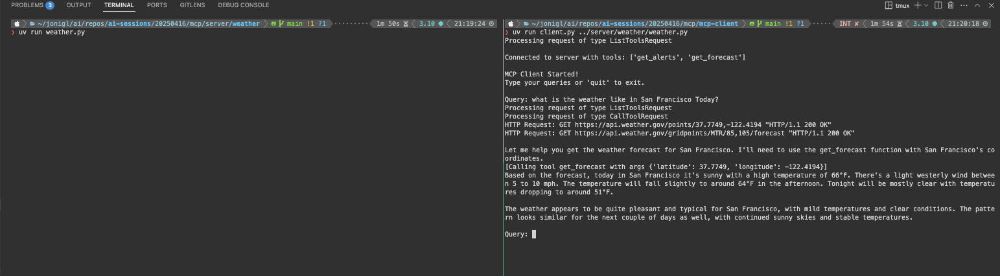

# Model Context Protocol - MCP

## What is MPC?

MCP is an open protocol that standardizes how applications provide context to LLMs. Think of MCP like a USB-C port for AI applications. Just as USB-C provides a standardized way to connect your devices to various peripherals and accessories, MCP provides a standardized way to connect AI models to different data sources and tools.

## This session

During this session we will be learning by doing. We will craete a simple hello world server and client. This way we can see how the model context protocol works in practice. 

We will be using the python SDK.

Here some helpful links:
- [Model Context Protocol](https://modelcontextprotocol.io/introduction)
- [Python SDK](https://github.com/modelcontextprotocol/python-sdk)
- [Server Example](https://modelcontextprotocol.io/quickstart/server)
- [Client Example](https://modelcontextprotocol.io/quickstart/client)


## Client and Server Example

Let's implement a simple MCP server and client to demonstrate how the Model Context Protocol works.

### Server Setup

To run the weather server:
```bash
cd mcp/server/weather
uv run weather.py
```

### Client Setup

To connect and interact with the server:
```bash
cd mcp/mcp-client
uv run client.py ../server/weather/weather.py
```

### Example Output




